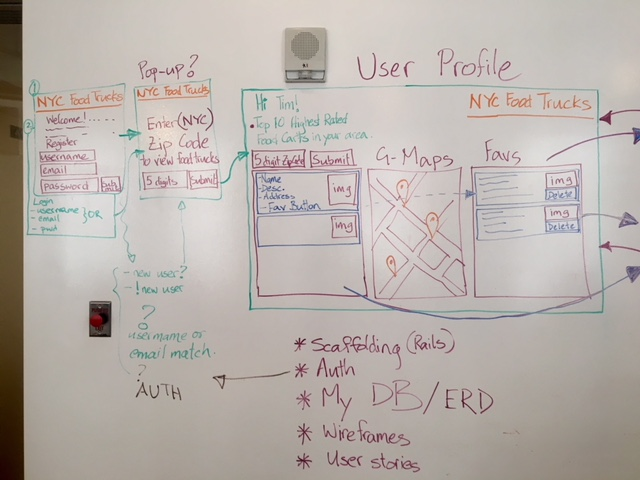
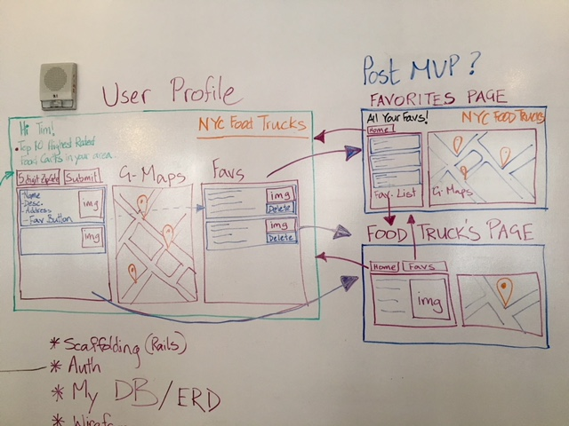
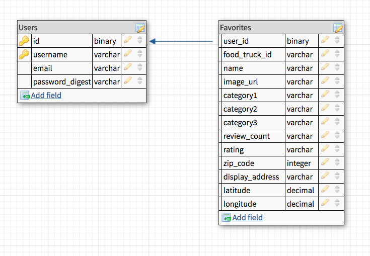

# Final Project (4) - Food Truck App

G-maps-api: https://www.fullstackreact.com/articles/how-to-write-a-google-maps-react-component/

A readme.md file with:
Explanations of the technologies used.
A couple of paragraphs about the general approach you took.
Installation instructions for any dependencies.
Link to your ERDs - Diagrams of your models and their relationships.
Link to your user stories – who are your users, what do they want, and why?
Link to your wireframes – sketches of views and interfaces in your application.
Descriptions of any unsolved problems or hurdles your team had to overcome.

## Overview & General Approach

I'm building a simpler version of Yelp but just for food trucks. The app will let people register/create a profile, then ask them to input a Zip Code, which will take them to their
home page. Logging in, if they already have a profile, will also ask them to input a Zip Code,
which will take the user to their home page that will display a list of food trucks with their
name, address, and a small photo. And next to the list will be a google map window of the
desired Zip Code along with markers for the food trucks that are on the list. Users will also
be able to add a food truck to their "favorites" list, which will be populated on the right
side of the app.

Initially, I had a similar idea but for beers. Finding and getting an API key for a beer db
was a massive challenge, so I moved on to food trucks. Next I spent 4+ hours trying to
get data from Yelp's API so that I could see the pieces of information I could display.

The wifeframes were fun to create, and now I'm working on the different pieces - user auth,
db, fetching data from Yelp with Zip Code, displaying that area and the food trucks on
google maps, and saving the favorites to a db.

#Modules / Technologies

react - this is a JS library for building user interfaces. It allows you to create highly reusable UI components that are on single page web apps, such as, tab bars, comment boxes, pop up modals, lists, sortable tables, etc.

react-router-dom - this package is a part of React Router and it's required for websites that will
run in browsers.

body-parser - this is a node.js middleware that allows you to parse incoming request bodies in a
middle ware before your handlers, which is available under the request.body property. Basically,
with body-parser we can grab the body of the HTTP request.

bcrypt.js - this is a library that hashes passwords. It lets us store an encrypted password, not plain text, in our database by salting and hashing the password entered by the user.

JWT - JSON Web Token is an open standard that defines a compact and self-contained way for securely transmitting information between parties as a JSON object. This information can be verified and trusted because it is digitally signed. JWTs can be signed using a secret or a public/private key pair using RSA.

bluebird.js - this is a fully-featured Promise library for JavaScript. The strongest feature of Bluebird is that it allows you to "promisify" other Node modules in order to use them asynchronously. Promisify is a concept applied to callback functions. This concept is used to ensure that every callback function which is called returns some sort of value. So if a Node JS module contains a callback function which does not return a value, if we Promisify the node module, all the function's in that specific node module would automatically be modified to ensure that it returns a value.

CORS - Cross-Origin Requests allows you to configure the web API's security. It has to do with allowing other domains to make requests against your web API. For example, if you had your web API on one server and your web app on another you could configure CORS in your Web API to allow your web app to make calls to your web API.

pg-promise -

yarn add --save google-maps-react - in root dir - https://medium.com/@yelstin.fernandes/render-a-map-component-using-react-google-maps-5f7fb3e418bb

#Milestone 1 User Stories
1 - As a food truck lover, I want to go to a website to see food trucks in a desired area.

2 - As a food cart lover, I want to input my zip code so I can see a list of food carts in that area.

3 - As a street meat lover, I want to see the cuisine of the food trucks so that I can pick what I want to eat.

5 - As a food truck lover, I want to see the address of the food trucks so that I know
where they are located.

5 - As a food cart lover, I want to see the carts on a map so I have an idea of their locations.

#Milestone 2 User Stories
6 - As a street food lover, I want to add certain carts to my favorites list.

7 - As a food truck lover, I want to create a profile so that I can log in any time to see
the list of food trucks I've favorited.

Wifeframes (use markdown-preview, "ctrl-shift-m")

#ERD

